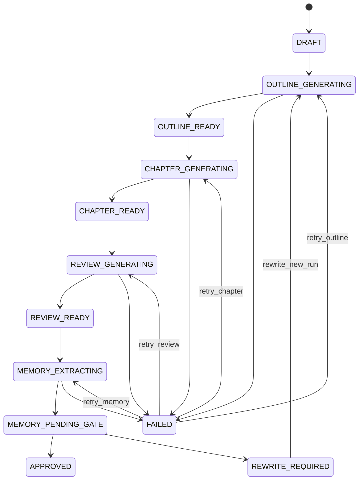

# PlotWeaver Spec（以 `novel-agent-day6/` 为当前参考实现）


更新时间：2026-03-14


本 spec 以仓库内当前最完整、可运行的实现 `novel-agent-day6/` 为“事实来源”，描述 PlotWeaver 的目标、边界、数据结构与端到端流程；同时标注可演进方向，便于后续把 Day1~Day6 的“日更原型”收敛成统一的产品/工程形态。


---


## 1. 背景与问题


轻小说续写的核心难点不在“能写”，而在“持续写得对”：


- 设定一致性：人物性格/口癖/关系、世界规则不能随意漂移（俗称“吃书”）。

- 情节推进：避免重复前文信息或水字数，需要持续制造冲突与悬念。

- 质量控制：生成质量不稳定，需要可解释的审校与回滚/闸门策略。


PlotWeaver 的策略是把续写拆成可验证的步骤（先规划再写，再审校），并用“可检索的记忆”与“质量闸门”把长程一致性纳入流程。


---


## 2. 目标与非目标


### 2.1 总目标（面向全量能力）


PlotWeaver 的目标不再局限于“单章续写闭环”，而是建设一个可部署的全栈写作系统，覆盖：长文本知识库、复杂多 Agent 协作、生产级服务与评测闭环。


目标能力包括：


1. 全文级（百万字）知识库与高召回 RAG

   - 支持把整本小说（正文、设定、审校、关系图谱）沉淀为可检索的知识库。

   - 支持混合检索（结构化过滤 + 全文检索 + 语义检索）与重排，提高“召回率优先”的检索质量。

   - 支持增量更新（新章写入后自动更新索引/向量/摘要），避免全量重建。


2. 复杂多 Agent 协作编排

   - 把“规划→写作→审校→记忆更新→重写/修订→发布”做成可配置的工作流。

   - 支持并行子任务（例如：人物一致性检查、伏笔清点、关系抽取、事实核对）与聚合决策。

   - 支持预算与闸门（token/时间/质量阈值），确保成本可控。


3. 生产级服务化（多租户/权限/计费）

   - 多用户登录与租户隔离（RLS/ACL），作品与数据按用户/组织隔离。

   - 可观测性（日志、指标、追踪）、可靠性（重试、幂等、队列）、安全（密钥、审计）。

   - 计费与配额（按调用/字数/时间/任务），并提供使用报表。


4. 端到端自动评测平台

   - 建立可复现的评测数据集与指标体系（吃书率、重复率、推进度、风格一致性等）。

   - 支持回归对比与质量闸门，作为上线与合并记忆的依据。


### 2.2 非目标（暂不优先）


- 离线/端侧大模型推理（on-device LLM）作为默认路径。

- 覆盖所有模型供应商/接口规范（优先稳定一条主路径，再抽象适配层）。

- 实时多人协同编辑（类似 Google Docs）作为首要需求。

---


## 3. 范围与现状（Day6 参考实现）


参考实现位于 `novel-agent-day6/`，其本质是一个 Python CLI：


- 通过 `openai` SDK（兼容 Ark/Volc Engine 的 base_url）调用模型生成：

  - `planner`：输出章节提纲 JSON

  - `writer`：输出章节草稿（可包含标题头）；系统会剥离标题头并落盘正文。Phase 1 起引入结构化 `chapter_meta.json` 作为权威元数据（标题/摘要/类型等，见 6.8）

  - `reviewer`：输出审校 JSON（评分 + 问题 + 建议）

- 通过文件系统组织输入、输出、与“记忆”材料

- 通过“增量记忆 + 闸门”策略控制何时将更新合并进主记忆


核心入口：`novel-agent-day6/app.py`  

工具调用封装：`novel-agent-day6/tools.py`  

使用说明：`novel-agent-day6/USAGE.md`


---


## 4. 用户与使用场景


### 4.1 目标用户


- 正在连载轻小说的作者/共同创作者（主要中文写作）

- 想要把“AI 续写”变成“可控的写作流程”的开发者/爱好者


### 4.2 典型场景


- 按章节续写：从 `chapter_004` 续写生成 `chapter_005`

- 重建记忆：当章节累积较多，重新从全部历史章生成三份主记忆

- 闸门合并：仅当审校达到阈值时，才把增量记忆合并进主记忆


---


## 5. 运行与配置


### 5.1 依赖


`novel-agent-day6/requirements.txt`：


- `openai>=1.0`

- `python-dotenv>=1.0.0`


### 5.2 环境变量（`.env`）


`novel-agent-day6/config.py` 读取：


- `ARK_API_KEY`：必填

- `ARK_MODEL`：必填

- `ARK_BASE_URL`：可选，默认 `https://ark.cn-beijing.volces.com/api/v3`


### 5.3 CLI 参数（`novel-agent-day6/app.py`）


- `--novel-id <id>`：默认 `demo`

- `--chapter-id <chapter_XXX>`：以输入章节为“上一章”，并尝试生成下一章

- `--prev <path>`：显式指定上一章文件（无 `--chapter-id` 时使用）

- `--req <path>`：续写要求（requirement）文件路径；默认 `novel-agent-day6/prompts/continuation_req.txt`（可为 `continuation_req.txt` 自由文本；全栈 API 推荐 `continuation_req.json`，见 6.7）

- `--style <path>`：可选风格约束文件

- `--refresh-memory`：从全部历史章节重建主记忆文件

- `--only-refresh-memory`：仅重建记忆后退出

- `--update-memory`：生成增量记忆并评估闸门，闸门通过后合并到主记忆

- `--gate-min-score <int>`：闸门阈值，默认 70

- `--gate-max-repetition <int>`：最多允许的重复问题条数，默认 2

- `--retry-with-review`：当指定 `--chapter-id` 时，将上一次审校的问题/建议拼接进本次 requirement


---


## 6. 目录结构与数据契约


### 6.1 输入目录（按 `novel_id`）


Phase 1 推荐输入结构（Day6 现状兼容；见 `novel-agent-day6/USAGE.md`）：


```

inputs/<novel_id>/

  chapters/

    chapter_001/

      chapter.txt

      chapter_meta.json

      title.txt

    chapter_002/

      chapter.txt

      chapter_meta.json

      title.txt

    ...

  memory/

    characters.json

    world_rules.md

    story_so_far.md

    updates/

      (运行后生成的增量文件)

```


语义约定：


- `chapters/chapter_*/chapter.txt`：该章正文（仅正文，不包含标题行）

- `chapters/chapter_*/chapter_meta.json`：Phase 1 起新增的权威元数据（标题/副标题/类型/卷归属/摘要等；见 6.8）。若缺失（Day6 现状），以 `title.txt` 作为最小兼容

- `chapters/chapter_*/title.txt`：兼容文件。若存在 `chapter_meta.json`，则由 `chapter_meta.json.title` 派生生成；若缺失，则作为 Phase 1 的过渡元数据来源（不从正文推断）

- `memory/*`：主记忆（为后续生成提供“可检索上下文”）


### 6.2 输出目录（按 `novel_id`）


Phase 1 输出结构（Day6 现状兼容；见 `novel-agent-day6/USAGE.md` 与 `novel-agent-day6/app.py`）：


```

outputs/<novel_id>/

  run_log.json

  chapters/

    chapter_005/

      outline.json

      chapter.txt

      chapter_meta.json

      title.txt

      review.json

      memory_gate.json   (仅 --update-memory 时)

```


### 6.3 JSON：章节提纲（`outline.json`）


由 `planner` 生成，固定结构（见 `novel-agent-day6/prompts/planner.txt`）：


```json

{

  "chapter_goal": "",

  "conflict": "",

  "beats": [],

  "foreshadowing": [],

  "ending_hook": ""

}

```


### 6.4 JSON：审校报告（`review.json`）


由 `reviewer` 生成，固定结构（见 `novel-agent-day6/prompts/reviewer.txt`）：


```json

{

  "character_consistency_score": 0,

  "world_consistency_score": 0,

  "style_match_score": 0,

  "repetition_issues": [],

  "revision_suggestions": []

}

```


> Reviewer 输出约定（工程化）：`revision_suggestions` 必须覆盖对结构化续写要求（`must_include/must_not_include/continuity_constraints`）的显式检查结论；如发现“高风险记忆写回候选”（同名/化名冲突、关键设定反转等），需明确建议进入人工闸门处理。


### 6.5 JSON：人物设定（`characters.json`）


人物主记忆不再以 `name` 作为唯一主键，而以稳定 `character_id` 作为权威标识；`name` 降级为展示与兼容字段。目标是支持同名角色、化名/别名、多身份，以及“合并需人工确认”的可控流程。


#### 6.5.1 角色对象结构（推荐）


```json

{

  "characters": [

    {

      "character_id": "char_kurono_001",

      "canonical_name": "黑野真",

      "display_name": "黑野真",

      "aliases": ["阿真", "黑野"],

      "tags": ["主角"],

      "role": "主角",

      "age": 17,

      "personality": ["谨慎", "吐槽系"],

      "background": ["旧钟楼事件幸存者"],

      "abilities": ["可感知时间回声"],

      "limitations": ["情绪失控时会诱发时间裂缝"],

      "motivation": ["查清导师隐瞒的真相"],

      "beliefs": ["任何力量都有代价"],

      "key_memories": ["曾在旧钟楼失去重要之人"],

      "story_function": ["推进主线"],

      "current_status": "受伤恢复中",

      "relationships": [

        {

          "target_character_id": "char_mentor_001",

          "relation_type": "师生",

          "strength": 0.82,

          "notes": "信任中带有怀疑"

        }

      ],

      "identities": [

        {

          "identity_id": "id_public_student",

          "name": "黑野真",

          "aliases": ["阿真"],

          "visibility": "PUBLIC",

          "description": "普通学生身份"

        }

      ],

      "ambiguity": [],

      "merge_status": "CONFIRMED"

    }

  ]

}

```


#### 6.5.2 字段规则


- `character_id`：角色唯一主键；进入数据库后不因改名而变化。

- `canonical_name`：当前作品视角下最稳定的标准称呼。

- `display_name`：前端默认展示名（可与 `canonical_name` 相同）。

- `aliases`：别名/化名/昵称/称谓集合，用于检索与候选匹配。

- `relationships[]`：关系边集合，使用 `target_character_id` 引用（避免用名称字符串建立关系）。

- `identities[]`：多身份表达层（伪装/马甲/称号身份等）；可用于“同一角色不同阶段的公开信息”。

- `ambiguity`：模型无法确定归属时写入候选说明，不直接污染主记忆。

- `merge_status`：`CONFIRMED | PENDING_REVIEW | SPLIT_REQUIRED | MERGED`。


#### 6.5.3 合并规则（Phase 1 冻结）


- delta 若携带 `character_id`：必须按 `character_id` 合并。

- delta 未携带 `character_id`：按 `canonical_name`/`aliases` 做候选匹配；若命中多个候选或疑似同名冲突，则 **不自动合并**，将该条目标记为 `PENDING_REVIEW` 并进入“人工合并决策”（见 16.2.3 / 附录 A）。


### 6.6 存储（Storage）与数据库职责划分（全栈规划）


决策：章节正文、草稿与长日志采用对象存储（Storage）；数据库只存元数据、索引与结构化结果。


原因：单本百万字 + 多版本迭代会让“长文本”快速膨胀；对象存储更适合大文件、版本化与 CDN 分发，数据库更适合检索、权限与结构化查询。


建议职责划分：


- 数据库（PostgreSQL）：作品/章节的结构、标题与排序、规划/审校等结构化 JSON、任务运行记录、权限与审计字段。

- Storage（如 Supabase Storage / S3）：章节正文（source）、草稿正文（drafts，多版本）、可选的提纲/审校原始文件镜像、较大体积的运行日志。


建议的 Storage Key 规范（示例）：


- `novels/<novel_id>/chapters/<chapter_id>/source.txt`

- `novels/<novel_id>/chapters/<chapter_id>/drafts/<draft_id>.txt`

- `novels/<novel_id>/chapters/<chapter_id>/outlines/<outline_id>.json`

- `novels/<novel_id>/chapters/<chapter_id>/reviews/<review_id>.json`


数据库中建议保存的 Storage 元数据字段（最小集合）：


- `storage_bucket`、`storage_key`

- `content_type`、`byte_size`、`sha256`

- `created_at`、`created_by`


注意：UI 展示标题/卷幕番外等元信息应来自数据库（或结构化 meta），不要依赖正文第一行。


### 6.7 结构化续写要求（`continuation_req.json`）


本项目把“续写要求”从自由文本升级为可校验、可存档、可对齐 UI/API 的结构化输入契约。本文统一称其为：**续写要求（requirement）**。


> 兼容策略：

> - 现有 Day6 CLI 可继续使用 `continuation_req.txt`（自由文本）。

> - 全栈 API（Phase 1 冻结目标）以 `continuation_req.json` 为主；若前端仍提交自由文本，后端应在创建 run 时把它转换/包装成结构化 requirement（记录 `source=free_text`），并保留原文。


#### 6.7.1 Schema（JSON 合同）


下面给出一个工程可实现的 JSON Schema（可用 Pydantic/JSON Schema 直接落地校验）：


```json

{

  "type": "object",

  "required": [

    "chapter_goal",

    "must_include",

    "must_not_include",

    "tone",

    "continuity_constraints",

    "target_length",

    "optional_notes"

  ],

  "additionalProperties": false,

  "properties": {

    "chapter_goal": { "type": "string", "minLength": 1, "maxLength": 500 },

    "must_include": { "type": "array", "items": { "type": "string", "minLength": 1, "maxLength": 200 }, "maxItems": 30 },

    "must_not_include": { "type": "array", "items": { "type": "string", "minLength": 1, "maxLength": 200 }, "maxItems": 30 },

    "tone": {

      "type": "object",

      "required": ["style", "pov", "language"],

      "additionalProperties": false,

      "properties": {

        "style": { "type": "string", "minLength": 1, "maxLength": 80 },

        "pov": { "type": "string", "enum": ["第三人称有限", "第一人称"] },

        "language": { "type": "string", "enum": ["中文"] },

        "tags": { "type": "array", "items": { "type": "string", "minLength": 1, "maxLength": 40 }, "maxItems": 20 }

      }

    },

    "continuity_constraints": {

      "type": "array",

      "items": { "type": "string", "minLength": 1, "maxLength": 400 },

      "maxItems": 50

    },

    "target_length": {

      "type": "object",

      "required": ["unit", "min", "max"],

      "additionalProperties": false,

      "properties": {

        "unit": { "type": "string", "enum": ["字"] },

        "min": { "type": "integer", "minimum": 200, "maximum": 20000 },

        "max": { "type": "integer", "minimum": 200, "maximum": 20000 }

      }

    },

    "optional_notes": { "type": "string", "maxLength": 4000 }

  }

}

```


#### 6.7.2 字段解释（前后端共同遵守）


- `chapter_goal`：本章要完成的明确目标（推进什么事件、揭示什么信息、制造什么悬念）。

- `must_include`：必须出现的要素清单（事件/道具/角色互动/关键台词线索）。应当可被 Reviewer 检查。

- `must_not_include`：明确禁止出现的要素（例如某角色提前登场、某设定被推翻、敏感内容等）。应当可被 Reviewer 检查。

- `tone`：文风与叙事约束。

  - `style`：如“日系轻小说、画面感清晰、对话自然”。

  - `pov`：视角约束（默认第三人称有限，与 Day6 prompt 对齐）。

  - `tags`：可选标签（例如“恋爱喜剧/异世界/悬疑/热血/慢热”等），用于检索与提示词拼装。

- `continuity_constraints`：连续性硬约束（不可违反的人设/世界规则/时间线事实）。建议写成可判定句。

- `target_length`：目标长度区间。

  - Phase 1 建议用“字数”作为单位；后续可扩展 token。

- `optional_notes`：补充信息（允许自由文本，但应视为“软约束”。）


#### 6.7.3 完整示例（单次续写任务）


```json

{

  "chapter_goal": "主角在追查时间裂缝线索时，发现导师留下的矛盾证词，并在结尾遭遇一次‘时间回声’的反噬，留下明确悬念。",

  "must_include": [

    "主角与导师的对话中出现‘旧钟楼’",

    "出现一次对‘时间回声’的具象描写（但不解释原理）",

    "结尾出现一个新的可追踪线索（物品或一句话）"

  ],

  "must_not_include": [

    "引入全新核心反派",

    "直接揭示时间裂缝的终极真相",

    "改变主角既有人设（胆小突然变莽）"

  ],

  "tone": {

    "style": "日系轻小说、画面感清晰、对话自然、节奏紧凑",

    "pov": "第三人称有限",

    "language": "中文",

    "tags": ["悬疑", "恋爱喜剧", "轻战斗"]

  },

  "continuity_constraints": [

    "主角当前已知：时间裂缝会在情绪剧烈波动时扩大",

    "导师对‘旧钟楼’的态度一贯回避（不可突然坦白全部）",

    "上一章结尾主角刚受伤（本章不可立刻满血跑酷）"

  ],

  "target_length": { "unit": "字", "min": 1800, "max": 2400 },

  "optional_notes": "避免大段旁白解释设定；把信息藏在动作与对话里。"

}

```


#### 6.7.4 前端/后端如何使用


- 前端：用表单/编辑器生成 `continuation_req.json`，在本地做 schema 校验并提示用户缺字段；提交给 API 创建 run。

- 后端：

  - 在 `POST /runs` 时验证 schema；把 requirement 作为 run 的输入快照持久化（DB JSONB），并计算 `requirement_hash` 参与幂等与审计。

  - 在 Worker 执行时，把 requirement 映射为提示词片段（硬约束优先，软约束其次）。


#### 6.7.5 Planner / Writer / Reviewer 如何消费


- Planner（生成提纲）：把 `must_include` 融入 beats，并显式避免 `must_not_include`；冲突时输出可执行折中方案供人类决策。

- Writer（生成正文）：逐项落地 `must_include` 为可在文本中定位的证据，并遵守 `target_length` 区间与 `continuity_constraints`。

- Reviewer（生成审校）：检查 `must_include`/`must_not_include`/`continuity_constraints` 的满足情况，并把不满足原因写入可执行建议，供 `REWRITE_REQUIRED` 使用。

### 6.8 章节元数据（`chapter_meta.json`）


目标：**彻底解耦**“章节标题/类型/卷归属/摘要”等元数据与“章节正文”文本。系统内任何展示、排序、索引与引用都以元数据为准，正文不再承担标题行/编号行。


#### 6.8.1 模型（结构化契约）


```json

{

  "type": "object",

  "required": [

    "chapter_id",

    "title",

    "order_index",

    "status",

    "summary",

    "created_at",

    "updated_at"

  ],

  "additionalProperties": false,

  "properties": {

    "chapter_id": { "type": "string", "minLength": 1, "maxLength": 64 },

    "kind": {

      "type": "string",

      "enum": ["NORMAL", "PROLOGUE", "SIDE_STORY", "EXTRA"]

    },

    "title": { "type": "string", "minLength": 1, "maxLength": 200 },

    "subtitle": { "type": ["string", "null"], "maxLength": 200 },

    "volume_id": { "type": ["string", "null"], "maxLength": 64 },

    "arc_id": { "type": ["string", "null"], "maxLength": 64 },

    "order_index": { "type": "integer", "minimum": 0, "maximum": 1000000 },

    "status": {

      "type": "string",

      "enum": ["DRAFT", "GENERATED", "REVIEWED", "APPROVED", "PUBLISHED"]

    },

    "summary": { "type": "string", "maxLength": 2000 },

    "created_at": { "type": "string", "format": "date-time" },

    "updated_at": { "type": "string", "format": "date-time" }

  }

}

```


#### 6.8.2 字段说明


- `chapter_id`：章节稳定标识（用于引用、索引、版本关联）。

- `kind`：章节类型。默认 `NORMAL`；`PROLOGUE`（序章）、`SIDE_STORY`（支线/外传）、`EXTRA`（番外/附录）。

- `title`/`subtitle`：纯文本标题与副标题；**不要求**以 `## 第X章` 等格式写入正文。

- `volume_id`/`arc_id`：可选的卷/篇章归属（用于 UI 分组与排序）。

- `order_index`：排序键（全局或卷内排序，由系统生成/维护；UI 不依赖正文推断）。

- `status`：章节生命周期状态（与 run 状态机不同，用于内容管理与发布）。

- `summary`：章节摘要（用于检索、回顾、RAG 提示组装；可由 Reviewer/Extractor 辅助生成，但需可编辑）。

- `created_at`/`updated_at`：ISO-8601 时间戳。


#### 6.8.3 支持卷结构与非标准章节（设计要点）


- 普通章节（NORMAL）：`volume_id` 可空；`order_index` 反映连载顺序。

- 序章（PROLOGUE）：`kind=PROLOGUE`，可设 `order_index=0`（或卷内最小值），UI 展示可用“序章”标签而非“第 0 章”。

- 支线/外传（SIDE_STORY）：`kind=SIDE_STORY`，可挂到特定 `volume_id/arc_id`，也可独立分组；排序仍由 `order_index` 控制。

- 番外/附录（EXTRA）：`kind=EXTRA`，通常不参与主线编号；UI 可按类型单独分页/列表。

- 卷（Volume）：卷本身应是独立实体（DB `volumes` 表或等价 JSONB），章节通过 `volume_id` 关联；卷标题、简介、封面等元数据不进入正文。


> 迁移说明：历史数据若只有 `chapter.txt` 且包含标题行，允许用一次性导入脚本提取“候选标题”填充到 `chapter_meta.json`，但运行态不再依赖正文第一行推断标题。


---


## 7. 端到端流程（Day6）


以 `--chapter-id chapter_004` 为例，期望生成 `chapter_005`：


1. （可选）`--refresh-memory`：读取全部 `chapters/chapter_*/chapter.txt` 拼成 `chapters_text`，生成三份主记忆：

   - `memory/characters.json`

   - `memory/world_rules.md`

   - `memory/story_so_far.md`

2. 读取上一章与续写要求：

   - 上一章：`inputs/<novel_id>/chapters/<chapter_id>/chapter.txt`（若指定 `--chapter-id`）

   - 续写要求：默认 `prompts/continuation_req.txt` 或 `--req` 指定

3. 构建记忆上下文（`build_memory_context()`）：

   - 从“上一章 + requirement”抽取关键词

   - 从 `characters.json` 抽取相关人物条目

   - 从 `world_rules.md`、`story_so_far.md` 里按关键词挑选少量行（各最多 5 行）

4. 生成提纲（`generate_outline()`）：

   - 失败时允许一次“修复 JSON”重试（`--max-retry`）

   - 写入 `outputs/<novel_id>/chapters/<next_id>/outline.json`

5. 生成正文（`generate_draft()`）与章节元数据（标题/摘要/类型等，见 6.8）：

   - writer 输出正文仅包含“正文内容”，不再要求第一行是标题。

   - 同步产出：

     - `outputs/.../chapter.txt`（正文）

     - `outputs/.../chapter_meta.json`（权威元数据：title/subtitle/kind/summary/order_index/status 等）

     - （可选兼容）`outputs/.../title.txt`（由 `chapter_meta.json.title` 派生；不再从正文推断）

   - 同时写回下一章输入目录，形成“连载”链条：

     - `inputs/.../chapters/<next_id>/chapter.txt`

     - `inputs/.../chapters/<next_id>/chapter_meta.json`

     - （可选兼容）`inputs/.../chapters/<next_id>/title.txt`

6. 生成审校报告（`generate_review()`）：

   - 写入 `outputs/.../review.json`

7. （可选）`--update-memory`：生成增量记忆与闸门合并：

   - 生成增量文件：

     - `inputs/.../memory/updates/characters_delta.json`

     - `inputs/.../memory/updates/world_rules_delta.md`

     - `inputs/.../memory/updates/story_so_far_delta.md`

   - 评估闸门并写入 `outputs/.../memory_gate.json`

   - 若通过闸门，合并增量到主记忆：

     - `merge_characters()`

     - `merge_world_rules()`

     - `merge_story_so_far()`


---


## 8. 记忆机制与合并策略


### 8.0 三层记忆（事实层 / 摘要层 / 提示层）


为兼顾“可追溯的连续性”与“可控的上下文长度”，PlotWeaver 将记忆拆为三层：


- 事实层（Fact Layer）：尽量结构化、可引用、可校验的事实（人物卡、关系边、时间线事实、世界规则条目等）。写入/合并必须经过闸门与人工确认，且要求带来源线索（引用章节/版本）。

- 摘要层（Summary Layer）：对长文本的压缩总结（剧情至今、世界规则摘要等），可由模型生成但应可编辑；用于快速对齐“当前状态”。

- 提示层（Prompt Layer）：每次 run 临时组装的上下文（从事实层/摘要层挑选片段 + 本次续写要求 + 上一章相关片段）。提示层不落为权威记忆，只作为可复现的输入快照（存 hash/指针）。


Phase 1 兼容说明：仍沿用 Day6 的 `characters.json`/`world_rules.md`/`story_so_far.md` 三文件，但在语义上分别对应“事实层（偏结构化）/摘要层/提示层”。提示层由 `build_memory_context()` 在 run 内临时生成。


### 8.1 主记忆（Base Memory）


当前主记忆由三份文件承载：


- `characters.json`：结构化人物卡（可被关键词摘要）

- `world_rules.md`：世界规则/设定要点（按行检索）

- `story_so_far.md`：剧情摘要要点（按行检索）


### 8.2 增量记忆（Delta Memory）


启用 `--update-memory` 时，基于“本章正文 + 已有主记忆”生成三份 delta 文件，落在 `memory/updates/`，目的：


- 允许先观察、再合并

- 在审校不过关时避免污染主记忆


- （新增）角色合并歧义：当 `characters_delta.json` 中存在 `merge_status=PENDING_REVIEW`/`SPLIT_REQUIRED`，或生成了 `characters_pending_review.json`，必须进入人工合并决策；在决策完成前禁止自动合并到主记忆。


### 8.3 闸门（Gate）


闸门的目标：在把任何 `memory delta` 写回主记忆之前，先做一次“质量 + 风险”的显式检查，避免同名/化名冲突与关键设定污染。


Phase 1 闸门输入（最小集合）：

- `review.json`（质量与一致性）

- `characters_delta.json` / `world_rules_delta.md` / `story_so_far_delta.md`（候选增量）

- （可选）`characters_pending_review.json`（角色歧义候选，由系统生成）


闸门规则（Phase 1 冻结）：

- 质量门槛：`character_consistency_score`/`world_consistency_score`/`style_match_score` 均需 >= `min_score`。

- 重复门槛：`repetition_issues` 条数需 <= `max_repetition`。

- 风险门槛（新增）：只要存在以下任一情况，则 **禁止自动合并**（`pass=false`）：

  - `characters_pending_review.json` 存在且非空。

  - `characters_delta.json` 中任一角色 `merge_status in (PENDING_REVIEW, SPLIT_REQUIRED)`。


输出：`memory_gate.json`（由 `evaluate_gate()` 生成），至少包含：

- `pass`：是否允许进入“自动合并”路径

- `issues[]`：未通过原因（例如 `character_consistency_score<70`、`repetition_issues>2`、`pending_character_merges>0`）


> 说明：通过闸门也不代表“无需人工”，它只表示“可以进入下一步”。对于 `merge_status` 相关歧义，必须在人工合并决策完成后才允许提交主记忆。


### 8.4 合并（Merge）


合并策略在 `novel-agent-day6/app.py` 中实现（摘要）：


- `merge_characters()`：按 `character_id` 优先合并；无 `character_id` 的候选条目进入 `PENDING_REVIEW` 并输出到“人工合并决策”，确认后再提交（避免同名/化名污染主记忆）

- `merge_world_rules()`：对 markdown 行做合并、去重与截断（最多保留 `max_items` 条）

- `merge_story_so_far()`：同上，最多保留 `max_items` 条


#### 8.4.1 人工合并决策（Merge Decision，Phase 1 文件化兼容）


当出现同名/化名/多身份等歧义（例如产生 `characters_pending_review.json`），系统必须把“合并/拆分/别名归并”从自动化路径中移出，转为可审计的人工决策对象。


建议的决策文件（Phase 1 兼容落点）：`merge_decisions/<decision_id>.json`


```json

{

  "decision_id": "md_20260314_0001",

  "novel_id": "novel_001",

  "run_id": "run_xxx",

  "created_at": "2026-03-14T12:00:00Z",

  "created_by": "user_xxx",

  "status": "PROPOSED",

  "actions": [

    {

      "type": "MERGE",

      "source_character_id": "char_a",

      "target_character_id": "char_b",

      "reason": "确认 A 与 B 为同一人（化名/别名）。"

    },

    {

      "type": "ALIAS_LINK",

      "character_id": "char_b",

      "alias": "阿真",

      "reason": "把新出现的称呼归并到别名集合。"

    }

  ]

}

```


应用规则（Phase 1 冻结）：

- `MERGE`：把 `source_character_id` 的可合并字段并入 `target_character_id`，并将 source 标记为 `merge_status=MERGED`（或在 UI 中隐藏）。

- `SPLIT`：把一个角色条目拆分为两个（需同时生成新的 `character_id`），并把冲突字段迁移到新角色。

- `ALIAS_LINK`：把新增称呼写入 `aliases[]`，提升后续匹配召回。

- 所有决策必须记录：决策人、时间、理由、关联的 `run_id/chapter_id`，并支持回滚（Phase 2 可增强）。


---


## 9. 可观测性与可复现性


`novel-agent-day6/tools.py` 维护 `run_log.json`，记录工具名、输入摘要与输出路径，用于：


- 回溯某次生成时调用了哪些“工具生成记忆”的步骤

- 在未来扩展更多工具（例如检索、格式化、评测）时保持统一日志结构


---


## 10. 失败模式与约束


### 10.1 常见失败模式


- planner/reviewer 非法 JSON：当前用 `extract_json_object()` 粗提取 + 重试一次；仍失败则报错退出

- writer 章节元数据缺失/非法：未生成 `chapter_meta.json` 或关键字段缺失（title/order_index/status/summary 等）会影响后续索引与展示；正文 `chapter.txt` 不再用于推断标题。

- 记忆文件缺失：`--refresh-memory` 可重建，但若 inputs 章节不足会导致记忆为空


### 10.2 约束与权衡


- 记忆检索是“关键词 + 行级截断”的轻量策略，优点是简单可控，缺点是召回有限

- 闸门目前只基于 reviewer 的结构化结果，仍属于“模型评模型”；后续可叠加规则与离线评测


---


## 11. 分期冻结计划（Phase 1 / Phase 2 / Phase 3）


本节把“终局愿景”（全文级 RAG、多 Agent、生产部署、评测平台）拆成可落地的三阶段。核心原则：


- 永远保留项目核心价值链：规划 -> 写作 -> 审校 -> 记忆更新 -> 人类闸门。

- Phase 1 以“单人可完成、可上线、可复现”为冻结目标；Phase 2/3 再追求规模化与高召回。


### Phase 1（冻结目标：单人可上线的 V1）


#### 目标


- 把 Day6 闭环从 CLI 形态提升为“可部署服务 + 可用 Web 控制台”。

- 把数据从文件系统过渡到“DB 元信息 + Storage 长文本”，支持版本化与审计。

- 保证续写质量可控：审校结构化、记忆增量、人工闸门合并。


#### 范围边界


- 重点解决“能持续写得对”的最小闭环与可视化操作。

- RAG 只做“够用且可扩展”的 V0：优先围绕结构化记忆与近邻章节（而不是全文高召回）。

- 多 Agent 只做“固定工作流”的编排（串行/少量并行），不做通用编排平台。


#### 核心交付物


- API v1（服务化）

  - 端点覆盖：生成提纲、生成正文、生成审校、生成增量记忆、闸门评估、人工合并记忆。

  - 任务模型：`run_id` 贯穿、幂等、可重试、可追溯（最小可观测性）。

- Web 控制台 v1

  - 登录后管理作品与章节；触发生成；查看 outline/draft/review；对 delta 记忆做“通过/拒绝/手工编辑后合并”。

- 数据落地 v1

  - Postgres：作品/章节元信息、结构化产物（outline/review/gate）、运行记录（runs）。

  - Storage：章节正文与草稿版本、长日志。

- RAG V0（可扩展）

  - 上下文组装：`characters`/`world_rules`/`story_so_far` + 最近 N 章摘要/片段。

  - 检索策略：先结构化过滤 + 轻量全文检索（不强制向量库）。

- 评测 V0

  - 固定一小组 test cases（例如 10~20 组），跑通回归记录（CSV/JSON）与人工抽查流程。

- 部署 V0

  - Web 上线（Vercel）+ API 部署（容器/Serverless 任一）；配置环境变量与基本告警。


#### 必须包含（Must-have）


- 规划（planner）-> 写作（writer）-> 审校（reviewer）全链路可一键触发并保存产物。

- 记忆增量（delta）与人工闸门：默认不自动污染主记忆。

- 章节版本化：至少保留每次生成的 draft/review/outline 及其输入引用。

- 基础权限：多用户登录；作品数据按用户隔离；操作留痕（最小审计）。


#### 明确不包含（Not included in Phase 1）


- 全文级（百万字）高召回 RAG：混合检索 + rerank + 关系图谱邻居扩展等放到 Phase 2。

- 通用多 Agent 编排平台：不做任意 DAG/动态角色市场；只做固定工作流。

- 生产级计费体系：不做付费/订阅/精细化计量；仅保留 usage 日志的落点。

- 大规模评测平台：不做在线 A/B、排行榜、自动化大规模 judge；仅做小规模回归。

- 移动 App：不做原生/小程序；Web 优先。


### Phase 2（能力扩展：全文级 RAG + 更强编排 + 评测体系）


#### 目标


- 建立“全文级知识库”与高召回检索：FTS + 向量 + 重排 + 邻居扩展。

- 引入更强的多 Agent 协作：并行子任务、自动改写回路、成本预算策略。

- 评测体系从 V0 升级为可持续回归：更丰富用例、指标与质量闸门。


#### 范围边界


- 仍以单作品/中等规模为主，不做跨作品共享记忆与跨租户知识市场。


#### 核心交付物


- RAG v1：pgvector（或等价向量能力）+ 混合检索 + rerank；增量索引流水线。

- 编排 v1：工作流可配置（step 开关/并行/重写次数/预算），并把子任务产物入库可追溯。

- 评测 v1：用例扩充（例如 100+）、自动打分 + 人工 spot-check、回归报告自动化。


### Phase 3（规模化与产品化：多租户、计费、稳定性与生态）


#### 目标


- 生产级多租户与计费：配额、计量、付费、风控、审计与运营。

- 稳定性与性能：队列化长任务、弹性扩缩、缓存、SLO、告警与成本优化。

- 生态与多端：移动端（Expo）、插件化工具/技能、第三方集成。


#### 核心交付物


- 计费与配额：按 token/字数/任务/存储等计量，提供账单与报表。

- 可靠性工程：任务队列、重放、幂等、数据迁移、灾备。

- 多端与生态：移动端、可扩展 skill/tool 系统、模板市场（可选）。

---


## 12. 开放问题（需要你确认的产品决策）


### 12.1 章节元数据与标题/卷结构（已确定）


问题背景（Day6 历史实现）：曾要求 writer 把“标题”放在正文第一行，并在保存时从正文切分出“标题部分”和“正文部分”。该做法会导致：卷/幕/番外等类型扩展困难、索引歧义、前端编辑回写复杂，以及 RAG/评测对齐不稳定。


Phase 1 冻结决策：**标题与章节类型不再从正文推断**，统一以结构化元数据为准（见 6.8 `chapter_meta.json` 与 13.2 `chapters` 表）。


- 权威来源：`chapter_meta.json`（或 DB `chapters` 记录）包含 `title/subtitle/kind/volume_id/arc_id/order_index/status/summary/timestamps`。

- 正文约束：`chapter.txt` 仅保存正文内容；UI 展示标题、卷信息、序章/番外标签等全部来自元数据。

- 兼容：保留 `title.txt` 仅作为派生/缓存文件（由 `chapter_meta.json.title` 生成），不作为“解析正文第一行”的替代方案。

- 索引：`order_index`（必要时叠加 `volume_id`）是唯一排序依据；“第 X 章”这类展示编号由前端按元数据渲染，不写入正文。


迁移策略（一次性）：若历史数据只有正文且包含标题行，可用导入脚本提取候选标题填充到元数据；但运行态不再依赖“正文第一行=标题”。

### 12.2 `characters.json` 合并主键：同名/化名/多身份


现状（Day6 参考实现）：


- `merge_characters()` 以 `name` 作为主键（`base_chars = {name: entry}`），同名会被视为同一人；delta 中列表字段做去重追加，字典字段做 `update()`，标量字段只在 base 为空时补全（见 `novel-agent-day6/app.py` 的 `merge_characters()`）。


风险：


- 同名不同人（路人甲/姓氏重名/艺名）会被错误合并，导致设定污染。

- 化名/昵称/外号（同一人多个称呼）会被拆成多个人物卡，导致“记忆检索”和“角色一致性评估”变差。

- “多身份”角色（伪装/马甲/人格）需要更强的表达能力，而不是单一 name。


建议的 spec 决策：引入稳定角色标识 `character_id`，并把 `name` 降级为展示字段。


- 角色主键（建议）：`character_id`（UUID 或稳定 slug），作为合并与引用的唯一主键。

- 命名体系（建议字段）：

  - `canonical_name`：对读者/主视角最常用的称呼

  - `aliases`：其他别名/化名/昵称/称谓（数组）

  - `display_name`：UI 展示用（可等同 canonical，也可带括注）

- 合并规则（建议）：

  - delta 若携带 `character_id`，必须按 id 合并。

  - 若无 id，按 `canonical_name` 或 `aliases` 的精确匹配尝试归并；若命中多个候选或疑似同名冲突，进入“待人工确认”状态（不自动合并），并记录在 `ambiguity` / `merge_notes`。

- 多身份表达（建议）：新增 `identities` 字段，允许一个角色拥有多个身份条目（每个身份可有自己的别名、公开信息、限制、与剧情触发条件）。


落地建议（面向全栈 UI）：


- 提供“合并人物/拆分人物/别名管理/身份管理”的编辑界面；把这类决策从 LLM 自动化中移出，保证可控。

- reviewer 的一致性检查可优先引用 `character_id`，减少名称漂移引起的误判。


### 12.3 闸门阈值（70/2）


闸门阈值是否需要按小说或风格自定义？是否需要加入“低分自动重写”的循环？


### 12.4 续写要求（requirement）结构化（已确定）


- Phase 1 起：服务化 API 统一使用结构化续写要求 `continuation_req.json`（schema 见 6.7），并在 `POST /runs` 时做校验与落库快照（`runs.requirement` JSONB + `requirement_hash`）。

- 兼容：Day6 CLI 仍可读取 `continuation_req.txt` 自由文本；当接入 API 时若仍提交自由文本，后端应封装为结构化续写要求（记录 `source=free_text`）并保留原文，以便审计与复现。


---


## 13. 数据库设计草案（全栈规划）


本节是面向“最终全栈产品”的规划性 schema 草案，用于指导后续落库与 API 设计；当前 Day6 仍以文件系统为主。


### 13.1 租户与权限


- 建议每条业务数据都带 `user_id`（或 `org_id`），用于多用户隔离与审计。

- 若采用 Supabase：优先用 RLS（Row Level Security）保障隔离。


### 13.2 核心业务表（建议）


- `novels`：作品基本信息（作者/简介/语言/状态），关联 `user_id`。

- `chapters`：章节元信息（`chapter_id`、`title`、`subtitle`（可选）、`kind`、`volume_id/arc_id`（可选）、`order_index`、`status`、`summary`、`created_at/updated_at`）；标题与类型不从正文推断。

- `chapter_versions`：正文版本元信息（对应 Storage key、版本号、来源：人工/生成、生成参数摘要）。


### 13.3 生成与审校


- `outlines`：提纲 JSON（可存 JSONB，必要时同步原始文件到 Storage）。

- `reviews`：审校 JSON（JSONB），并保留关键分数列用于查询与闸门。

- `runs`：一次续写运行的权威记录（强烈建议作为状态机落点，见 16.5）：

  - 主键：`run_id`；关联：`novel_id`、`base_chapter_id`、`target_chapter_id`、`user_id`/`org_id`

  - 状态：`state`（枚举）、`state_updated_at`

  - 幂等：`idempotency_key`（唯一映射到 `run_id`）

  - 重试：`attempts`（按 step 或总数）、`max_retries`、`last_error_code/message`

  - 并发控制：`worker_id`、`lease_expires_at`、`heartbeat_at`

  - 产物指针：`current_outline_version_id`、`current_chapter_version_id`、`current_review_version_id`、`current_memory_delta_version_id`、`current_gate_version_id`

  - 输入快照：输入引用、模型/提示词版本、context 装配摘要、输入 hash- `tool_calls`：工具调用日志（对应 `run_log.json` 的结构化落库版本）。


### 13.4 记忆与角色系统


- `characters`：以稳定 `character_id` 为主键；`canonical_name`/`display_name`；性格/背景/能力等建议 JSONB。

- `character_aliases`：别名表（化名/昵称/称谓），用于归并与检索。

- `character_relations`：关系边（from/to/type/strength/证据章节/备注）。

- `memory_documents`：世界规则与剧情摘要（可存“结构化条目 + 引用”，正文放 Storage）。

- `memory_updates`：增量记忆（delta）记录（含闸门结果与是否合并）。

- `merge_decisions`：同名/化名冲突的人工确认记录（可追溯、可回滚）。


### 13.5 检索（可选）


- 全文检索：优先用 Postgres FTS（对标题、摘要、关系备注等字段）。

- 语义检索：需要时再加 `pgvector`：

- `embeddings`：`owner_type`（character/world/story/chapter）、`owner_id`、`field`、`embedding`、`updated_at`。


### 13.6 Storage（与数据库配合）


- 大文本（章节正文/草稿/长日志）放 Storage，DB 保存引用与校验信息。

- 前端获取正文走签名 URL（或后端转发），并结合权限控制。


---


## 14. 全文级 RAG（高召回优先）设计


目标：在“百万字规模”下，仍能稳定检索到与当前续写相关的设定、关系与伏笔；召回优先，其次再通过重排与闸门控住精度与成本。


### 14.1 数据来源


- 正文：章节 source/drafts（Storage）

- 结构化产物：outline/review/memory_gate（DB JSONB + 可选原始文件镜像）

- 记忆：characters/world_rules/story_so_far、关系图谱（DB）

- 人工标注：merge_decisions、关键伏笔/硬约束（DB）


### 14.2 索引形态（建议）


- 结构化索引：按 `novel_id`/`chapter_id`/`character_id` 过滤

- 全文检索：Postgres FTS（标题、摘要、关系备注、世界规则条目）

- 语义检索：pgvector（对摘要、角色卡、关系边、章节片段做 embedding）

- 关系检索：角色关系图（边表），用于“邻居扩展召回”


### 14.3 分块与摘要


- 正文不建议直接向量化整章：应按段落/场景切分，并为每块生成“可检索摘要”。

- characters/world_rules/story_so_far 优先维护结构化条目与短摘要，再向量化摘要文本。


### 14.4 检索策略（高召回）


- 初筛：结构化过滤（角色/章节范围/时间线） + FTS 召回

- 语义补召回：向量 TopK（按来源分桶：角色卡/关系边/世界规则/剧情摘要/正文片段）

- 扩展：关系图谱邻居扩展（与当前角色相关的 1-hop/2-hop 关系）

- 重排：交叉编码器/LLM rerank（只对候选集合）

- 组装：按“硬约束优先（世界规则/人物卡）→ 剧情摘要 → 相关正文片段”拼接上下文


### 14.5 增量更新


- 新章生成后：写入 Storage → 生成摘要/结构化抽取 → 更新 FTS/向量/关系边。

- 失败回滚：以 `run_id` 追踪写入，支持撤销本次索引写入。


---


## 15. 多 Agent 协作编排（Workflow Orchestrator）


目标：把写作流程显式化为“可配置工作流”，支持并行子任务、质量闸门与人机协作。


### 15.1 基本角色（可扩展）


- Planner：生成结构化提纲

- Writer：基于提纲与上下文写正文

- Reviewer：输出结构化审校

- Memory Curator：抽取/更新记忆与关系

- Fact Checker（可选）：对硬设定/时间线做核对

- Rewriter（可选）：针对审校问题做定向修订


### 15.2 工作流建模


- 每个 step 输入/输出都有 schema；所有产物关联 `run_id`。

- 支持并行：例如“关系抽取/重复检测/伏笔清点”并行完成后汇总。

- 支持策略：低分自动重写次数上限、成本预算、人工介入点。


### 15.3 质量与成本控制


- 质量闸门：审校分数、重复问题、硬约束冲突。

- 成本预算：token 上限、时间上限、重试上限。

- 幂等与可恢复：同一 `run_id` 可重试且不会重复写入最终产物。


---


## 16. 生产级服务化（多租户/权限/计费/部署）


### 16.1 API 边界


- API 负责：鉴权、任务编排、读写 DB/Storage、返回状态与产物引用。

- Engine 负责：生成/审校/抽取的纯业务逻辑（未来从 Day6 抽离）。


#### 16.1.1 创建续写 Run（`POST /runs`）请求示例


说明：`requirement` 必须满足 6.7 的 `continuation_req.json` schema；`user_id/org_id` 来自鉴权上下文（不由客户端显式传）。


```json

{

  "idempotency_key": "client-uuid-20260314-0001",

  "novel_id": "novel_001",

  "base_chapter_id": "chapter_004",

  "target_chapter_id": "chapter_005",

  "requirement": {

    "chapter_goal": "本章要达成的明确目标（简述即可）",

    "must_include": ["必须出现的要素 A", "必须出现的要素 B"],

    "must_not_include": ["禁止出现的要素 A"],

    "tone": {"style": "日系轻小说、画面感清晰、对话自然", "pov": "第三人称有限", "language": "中文", "tags": ["恋爱喜剧"]},

    "continuity_constraints": ["连续性硬约束 1", "连续性硬约束 2"],

    "target_length": {"unit": "字", "min": 1800, "max": 2400},

    "optional_notes": "补充说明（可空）"

  }

}

```


成功响应（示意）：返回 `run_id` 与初始 `state=DRAFT`（或已入队则 `state=OUTLINE_GENERATING`），并可通过 `GET /runs/{run_id}` 轮询状态与产物引用。


### 16.2 多租户与权限


#### 16.2.1 多租户边界


- 以 `org_id`（可选）+ `user_id` 作为租户边界：同一 `org_id` 下可协作，不同 `org_id` 必须强隔离。

- 所有业务对象（novel/chapter/run/memory delta/merge decision/eval run 等）都必须带 `owner_org_id/owner_user_id` 并参与访问控制与审计。

- Storage 访问通过签名 URL 或后端代理，避免绕过权限读取正文/草稿/日志。


#### 16.2.2 Phase 1 权限模型（最小可用）


- 角色（RBAC）：`OWNER`、`EDITOR`、`REVIEWER`、`VIEWER`。

- 权限要点：

  - `OWNER/EDITOR`：创建/更新作品与章节元数据；触发 `POST /runs`；查看产物；提交重写；发起合并决策。

  - `REVIEWER`：查看产物；审批 `memory delta`；处理 `PENDING_REVIEW` 的角色合并/拆分决策。

  - `VIEWER`：只读查看作品、章节元数据与已批准产物。

- 注意：run 的执行 worker 不等同于用户角色；worker 只以服务身份读写其被授权的 `run_id` 相关资源（最小权限）。


#### 16.2.3 人工介入后台（Admin Console / Moderation）


- 目标：把“不可自动化的决策”集中到可审计的界面与 API：

  - `memory delta`：通过/拒绝/编辑后合并。

  - `merge decision`：同名/化名冲突的角色合并、拆分、别名归并。

- 后端必须记录：决策人、决策时间、理由、涉及的 `run_id/chapter_id/character_id`，并支持回滚（Phase 2 可增强）。


### 16.3 计费与配额


- 计量维度：请求次数、生成字数、token、任务耗时、存储与向量条目数。

- 配额策略：按用户/组织限制并发与速率；超额拒绝或排队。


### 16.4 可观测性与安全


- 结构化日志：`run_id` 贯穿，便于排查与审计。

- 指标：成功率、延迟、成本、闸门通过率、重写次数。

- 安全：密钥只在后端；敏感数据脱敏；操作留痕。


### 16.5 Run 运行状态机（实现导向）


本节定义“续写一次运行（run）”的状态机，用于后端 API、worker、DB 与 Storage 的一致实现。


#### 16.5.1 核心对象与命名


- `run_id`：一次续写运行的全局唯一标识（贯穿日志、产物、计量与审计）。

- `target_chapter_id`：本次运行要产出的目标章节（通常是 `chapter_005` 这类逻辑编号）。

- `base_chapter_id`：作为“上一章”的输入章节（用于检索与对齐）。

- `artifact_version`：每个阶段产物都版本化（outline/chapter/review/memory_delta/gate）。重试默认“新建版本”，不覆盖旧版本。

- `idempotency_key`：客户端提供的幂等键；相同键的重复请求返回同一 `run_id`。


> 约定：DB 存元信息与结构化结果；大文本/大文件产物存 Storage，DB 仅保存 Storage key + 校验信息。


#### 16.5.2 状态集合


状态机至少包含以下状态（全部为单向推进；允许失败回退到 `FAILED` 或人工触发重写）：


- `DRAFT`

- `OUTLINE_GENERATING`

- `OUTLINE_READY`

- `CHAPTER_GENERATING`

- `CHAPTER_READY`

- `REVIEW_GENERATING`

- `REVIEW_READY`

- `MEMORY_EXTRACTING`

- `MEMORY_PENDING_GATE`

- `APPROVED`

- `REWRITE_REQUIRED`

- `FAILED`


#### 16.5.3 主流程与显式转移





#### 16.5.4 各状态的推进者、成功/失败、重试与版本规则


实现时以“状态 + 产物版本”双维度保证可恢复与可追溯。


- `DRAFT`

  - 推进者：API（完成参数校验、幂等判定、落库 run 记录、入队）。

  - 成功转移：`OUTLINE_GENERATING`。

  - 失败行为：入队失败或校验失败则 `FAILED`（记录错误原因）。

  - 重试：允许；不产生新产物版本；仅重新入队。


- `OUTLINE_GENERATING`

  - 推进者：worker（Planner）。

  - 成功转移：生成 `outline_version` 后进入 `OUTLINE_READY`。

  - 失败行为：记录 `error_code/error_message`；若未超出重试上限，留在本状态并进入下一次 attempt；否则 `FAILED`。

  - 重试：允许；每次重试新建 `outline_version`（不覆盖旧版本）。


- `OUTLINE_READY`

  - 推进者：worker（自动进入下一步）或 API（支持手动“继续/编辑提纲后继续”）。

  - 成功转移：`CHAPTER_GENERATING`。

  - 失败行为：若进入下一步时发现提纲缺失/不合法，转 `FAILED`（错误归因到 outline）。

  - 重试：允许；若仅修复提纲，走 `retry_outline` 产生新 `outline_version`。


- `CHAPTER_GENERATING`

  - 推进者：worker（Writer）。

- 成功转移：生成 `chapter_version`（正文）+ `chapter_meta_version`（标题/类型/摘要/排序/状态等，见 6.8）后进入 `CHAPTER_READY`。

  - 失败行为：同上；超过上限则 `FAILED`。

  - 重试：允许；每次重试新建 `chapter_version`。


- `CHAPTER_READY`

  - 推进者：worker（自动进入审校）或 API/人类（允许先人工微调正文再审校）。

  - 成功转移：`REVIEW_GENERATING`。

- 失败行为：若正文缺失/不可读，或 `chapter_meta` 缺失/不合法（关键字段缺失），`FAILED`。

  - 重试：允许；`retry_chapter` 新建 `chapter_version`（保留旧版本）。


- `REVIEW_GENERATING`

  - 推进者：worker（Reviewer）。

  - 成功转移：生成 `review_version` 后进入 `REVIEW_READY`。

  - 失败行为：同上；超过上限则 `FAILED`。

  - 重试：允许；每次重试新建 `review_version`。


- `REVIEW_READY`

  - 推进者：worker（自动进入记忆抽取）或 API/人类（先确认审校结论再继续）。

  - 成功转移：`MEMORY_EXTRACTING`。

  - 失败行为：若审校结果缺失/不可解析，`FAILED`。

  - 重试：允许；`retry_review` 新建 `review_version`。


- `MEMORY_EXTRACTING`

  - 推进者：worker（Memory Curator）。

  - 成功转移：生成 `memory_delta_version` 后进入 `MEMORY_PENDING_GATE`。

  - 失败行为：同上；超过上限则 `FAILED`。

  - 重试：允许；每次重试新建 `memory_delta_version`。


- `MEMORY_PENDING_GATE`

  - 推进者：人类（Web 控制台点击“通过/拒绝/编辑后通过”）；允许系统先给出自动 gate 建议，但最终以人类为准（Phase 1 冻结要求）。

  - 成功转移：

    - 人类通过：进入 `APPROVED`，并产生 `gate_version`（记录闸门决策与合并结果）。

    - 人类要求重写：进入 `REWRITE_REQUIRED`（记录原因与建议）。

  - 失败行为：合并写入失败则 `FAILED`（必须可重试且不可丢失决策）。

  - 重试：允许；重试不覆盖 `memory_delta_version`，仅对“合并动作”重试；`gate_version` 每次决策新建版本。


- `APPROVED`

  - 推进者：系统（完成落库、索引/缓存更新，可异步）。

  - 成功转移：终态。

  - 失败行为：若后置任务（如索引更新）失败，不应回退主状态；记录到 `post_tasks` 并可重试。

  - 重试：允许后置任务重试；不创建新的章节/审校版本。


- `REWRITE_REQUIRED`

  - 推进者：人类（基于 review 与 gate 原因触发“重写”）。

  - 成功转移：通常通过“新建 run”回到 `OUTLINE_GENERATING`（`rewrite_new_run`），以便清晰保留历史尝试。

  - 失败行为：新 run 创建失败则 `FAILED`（旧 run 保持终态）。

  - 重试：允许；不覆盖旧 run。


- `FAILED`

  - 推进者：系统（自动失败）或 worker（不可恢复错误）。

  - 成功转移：无（除非触发某个 `retry_*` 行为）。

  - 重试：允许；重试策略见 16.5.6。


#### 16.5.5 并发与幂等规则（Concurrency + Idempotency）


- 同一 `target_chapter_id` 是否允许并发 run：

  - Phase 1 默认不允许同一目标章节并发运行（避免重复写入与闸门冲突）。

  - 允许不同章节并发；允许同一作品的多个章节同时排队。

- 去重与防重复任务：

  - DB 层对“活跃 run”加唯一约束（建议：同一 `target_chapter_id` 只能存在一个 `state in (DRAFT, *_GENERATING, *_READY, MEMORY_PENDING_GATE)` 的 run）。

  - worker 取任务使用“租约（lease）”机制：同一 run 同一时刻只被一个 worker 持有。

- 幂等策略：

  - `POST /runs` 必须接收 `idempotency_key`；服务端把 key 映射到 `run_id`，重复请求返回既有 run。

  - 每个 step 的执行也要有幂等键：`task_key = run_id + state + attempt`；重复执行时只会“检查并推进”，不会重复落产物。


#### 16.5.6 恢复与续跑策略（Crash Recovery + Resume）


- worker 崩溃恢复：

  - run 记录包含 `worker_id`、`lease_expires_at`、`heartbeat_at`。

  - 若 `lease_expires_at` 超时且状态仍在 `*_GENERATING`/`MEMORY_EXTRACTING`，调度器可重新入队并由新 worker 接管。

- 中间产物持久化：

  - 每个阶段产物写入 Storage 后，必须先落 DB 的 `artifact_version` 再推进状态（避免“文件已写但状态未推进”的丢失）。

  - run 应保存关键输入摘要：输入章节引用、requirement、上下文装配摘要、模型/提示词版本、输入 hash。

- 续跑（resume-from-step）：

  - worker 开始执行某 step 时先做“存在性检查”：若最新 `artifact_version` 已存在且校验通过，直接推进到对应 `*_READY` 状态，不重新生成。

  - 若处于 `FAILED` 且触发 `retry_*`：新 attempt 生成新 `artifact_version`；旧版本保持可追溯。

  - 若仅后置任务失败（例如索引更新），不回退主 run 状态，通过 `post_tasks` 重试完成。

---


## 17. 端到端评测平台（Eval Harness）


目标：让“写得好不好”可被度量、可回归、可作为发布闸门。


### 17.1 评测数据


- test case：上一章摘要/硬设定/本章要求/期望点（伏笔、推进、禁忌）

- 参考答案：可选（人工/历史章节），或仅提供评价维度与约束


### 17.2 指标建议


- 一致性：人设/世界规则冲突率（规则 + 检索对照 + LLM judge）

- 重复：重复句/段、口头禅过载

- 推进：新增信息量、事件推进度、悬念强度

- 质量：可读性、风格匹配、对话自然度


### 17.3 回归与闸门


- 任何提示词/模型/检索策略变更都跑回归。

- 评测结果进入：合并记忆闸门、上线发布闸门、A/B 对比。


### 17.4 文件结构（建议）


为保证“可回归、可对比、可审计”，评测数据与评测运行记录建议独立落盘/落库：


```

eval_cases/

  (case 定义：输入摘要、约束、续写要求、期望点、评分维度)

eval_runs/

  (运行记录：每次回归的结果快照、对比报告)

```


- `eval_cases/`：稳定的用例集合（随版本演进，但需版本号/变更记录）。

- `eval_runs/`：每次回归的结果快照（包含模型/提示词/检索策略/代码版本信息），用于定位“哪次变更导致退化”。


### 17.5 回归对比（最小规则）


- 每次重要变更（prompt/模型/检索策略/记忆合并策略）必须跑一轮回归，并与上一个 baseline 对比：

  - 指标退化超过阈值则阻断：例如一致性分数下降、重复问题数上升、硬约束违例增加。

  - 允许人工豁免，但必须记录理由与责任人（审计）。


---


## 附录 A. 术语与命名统一（全仓库）


### A.1 产物文件命名


- 正文：`chapter.txt`

- 章节元数据：`chapter_meta.json`

- 审校：`review.json`

- 提纲：`outline.json`

- 记忆闸门：`memory_gate.json`

- 续写要求：`continuation_req.json`（结构化）


### A.2 主键命名统一


- `novel_id`、`chapter_id`、`run_id`、`character_id`、`delta_id`（memory delta）、`eval_case_id`、`eval_run_id`

- 状态字段统一：

  - `state`：用于 run 运行状态机（见 16.5）

  - `status`：用于内容对象状态（如 chapter / memory delta 等）


### A.3 文档与接口用词统一


- 文档中出现 `requirements`（复数）用于指代续写要求时，一律改为“续写要求（requirement）”。

- 文档/API 中出现 `job/task` 指代一次生成流程时，一律用 `run`。

- 文档中出现 `section` 指代章节时，一律用 `chapter`。

- 文档中出现 `memory update` 指代待审核写回时，一律用 `memory delta`（增量记忆）。


