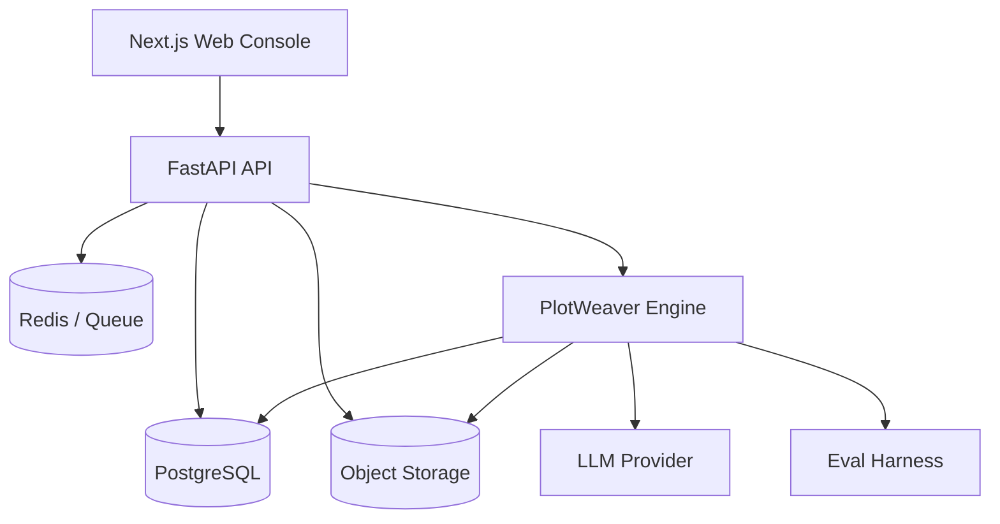
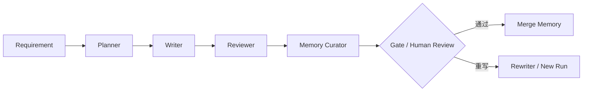

# PlotWeaver 项目计划与技术规格书（以 `novel-agent-day6/` 为事实基线）

更新时间：2026-03-15

本文档不再把 PlotWeaver 仅视为“一个能跑通的 Day6 CLI 原型”，而是把它定义为一个面向长篇连载写作的全栈式 AI Agent 产品计划书。文档采用以下重构顺序：

1. `product-requirements`：明确产品定位、用户、场景、范围与成功标准。
2. `software-architecture-design`：明确全栈架构、模块边界与技术选型。
3. `ai-agent-development`：明确 Agent 角色、输入输出契约与工作流。
4. `architecture-documentation`：把数据契约、目录结构、状态机和服务边界写成可执行规范。
5. `create-implementation-plan`：把愿景拆成阶段目标、里程碑与交付物。
6. `validate-implementation-plan`：补充风险、验收口径与实施约束，确保文档能指导真正落地。

事实来源约束：

- “项目现在怎么工作”，以 `novel-agent-day6/` 为准。
- “项目应该演进成什么”，以本文档为准。
- 所有结构化输出契约一旦变更，必须同步更新本文档。

---

## 1. 项目概况（Executive Summary）

### 1.1 产品定位

PlotWeaver 是一个面向中文长篇小说创作的 AI 写作系统。它不是“让模型一次性写出一章”的包装壳，而是把续写拆成可验证、可回滚、可审校、可积累记忆的多阶段工作流。

它要解决的核心问题不是“能不能写”，而是“能不能持续写得对”：

- 角色、人设、关系和世界规则不能漂移。
- 剧情需要稳定推进，而不是重复前文或堆字数。
- 每次生成都要有质量判断、失败兜底和人工介入点。
- 长篇作品需要把前文、设定、审校结果沉淀成可检索知识，而不是每次重新喂上下文。

### 1.2 最终目标

PlotWeaver 的最终目标是成为一个可部署的全栈写作产品：

- Web 优先，后续可扩展移动端。
- 支持作品管理、章节生成、审校、记忆治理与人工闸门。
- 支持多 Agent 协作，而不是单一“写作模型”调用。
- 支持服务化运行、长期存储、评测回归和后续商业化演进。

### 1.3 Phase 1 核心承诺

Phase 1 不追求“所有能力都做完”，而追求三件事：

- 把 Day6 的 CLI 闭环提升为可部署的 API + Web 控制台。
- 把“规划 -> 写作 -> 审校 -> 记忆更新 -> 人工闸门”跑成稳定主链路。
- 把关键数据契约冻结下来，让后续开发不再反复改结构。

### 1.4 成功标准

如果 Phase 1 成功，团队应该能做到：

- 从任意已有章节稳定生成下一章，并保留完整产物链路。
- 明确知道每次生成用了什么输入、什么要求、什么记忆、什么模型和什么提示版本。
- 在质量不足或角色冲突时，阻止自动污染主记忆。
- 用 Web 界面完成大多数操作，而不是依赖 CLI 和手工改文件。

---

## 2. 产品需求与范围（Product Requirements）

### 2.1 目标用户

核心用户分两类：

- 连载型作者或共同创作者：需要按章节持续推进长篇作品。
- 希望把“AI 写作”做成稳定流程的开发者或工作室：需要可控、可追踪、可服务化的写作基础设施。

### 2.2 典型使用场景

1. 按章节续写
   从 `chapter_004` 生成 `chapter_005`，要求显式指定本章目标、必须包含和禁止出现的内容。

2. 复盘与审校
   查看提纲、正文、审校报告和问题定位，决定是否接受当前版本或触发重写。

3. 记忆治理
   生成 `memory delta`，由系统给出 gate 建议，再由人决定是否合并进主记忆。

4. 长篇演进
   随着章节增加，把人物、世界规则、剧情摘要和关系线逐步沉淀为结构化知识资产。

### 2.3 核心需求

PlotWeaver 必须满足以下产品需求：

- 支持结构化续写要求，而不是只依赖自由文本 prompt。
- 支持结构化提纲、正文元数据、审校结果和记忆闸门输出。
- 支持把长文本和结构化元数据分开存储。
- 支持 run 级别的状态、幂等、重试和版本追溯。
- 支持人工闸门与角色合并决策，避免“自动吃书”。

### 2.4 非目标

以下内容不属于 Phase 1 的优先范围：

- 端侧离线大模型推理。
- 实时多人协同编辑。
- 通用型 Agent 市场或任意 DAG 编排平台。
- 精细化计费、订阅与商业结算。
- 原生移动 App。

---

## 3. 当前事实基线（Day6 参考实现）

### 3.1 Day6 已有能力

当前仓库里最完整、可运行的事实实现位于 `novel-agent-day6/`，本质上是一个 Python CLI：

- `planner` 生成 `outline.json`
- `writer` 生成 `chapter.txt`
- `reviewer` 生成 `review.json`
- `--refresh-memory` 重建主记忆
- `--update-memory` 生成增量记忆并执行闸门评估

它已经证明了 PlotWeaver 的核心闭环是成立的，但它仍然停留在单机脚本形态。

### 3.2 Day6 当前限制

Day6 能跑，但还不够像产品，主要问题包括：

- 入口是 CLI，不适合作为协作和部署形态。
- 长文本、结构化结果和运行日志主要以文件形式存在，缺少数据库与服务边界。
- 记忆检索还是轻量关键词拼装，不足以支撑全文级 RAG。
- 标题、章节管理、状态管理、人工闸门与角色歧义处理尚未完整服务化。

### 3.3 当前运行配置

Day6 运行依赖：

- Python
- `openai>=1.0`
- `python-dotenv>=1.0.0`

环境变量：

- `ARK_API_KEY`：必填
- `ARK_MODEL`：必填
- `ARK_BASE_URL`：可选，默认 `https://ark.cn-beijing.volces.com/api/v3`

CLI 关键参数：

- `--novel-id`
- `--chapter-id`
- `--prev`
- `--req`
- `--style`
- `--refresh-memory`
- `--only-refresh-memory`
- `--update-memory`
- `--gate-min-score`
- `--gate-max-repetition`
- `--retry-with-review`

结论：Day6 是事实基线，但不是最终产品形态。

---

## 4. 总体系统架构（Software Architecture Design）

### 4.1 架构原则

PlotWeaver 的总体架构遵守四条原则：

- Web First：优先交付网页端工作台，再考虑移动端复用。
- Engine 与 Service 分离：把生成逻辑从 CLI 中抽离成可复用引擎。
- DB 存元数据，Storage 存长文本：避免章节正文把数据库拖成大文件仓库。
- 人机协同优先：自动化负责生成和建议，人类负责高风险决策。

### 4.2 推荐技术栈

| 层级 | 技术 | 职责 |
| --- | --- | --- |
| Web | Next.js（App Router）+ TypeScript | 作品管理、章节工作台、审校与闸门界面 |
| API | FastAPI + Pydantic | OpenAPI、鉴权、run 编排、数据读写 |
| Engine | Python | Planner / Writer / Reviewer / Memory Curator 等核心能力 |
| Database | PostgreSQL（建议 Supabase） | 元数据、结构化产物、权限、状态机 |
| Storage | Supabase Storage / S3 | 正文、草稿、长日志、原始产物 |
| Queue | Redis + RQ/Celery（可选） | 长任务、重试、异步编排 |
| Realtime | SSE 或 WebSocket（可选） | run 状态与进度推送 |
| Eval | 文件 + DB 混合 | 测试用例、回归结果、质量闸门 |

### 4.3 总体架构图



### 4.4 核心模块划分

1. 作品工作台
   管理作品、章节、元数据、生成记录与人工操作。

2. Run 服务
   负责接收续写请求、做参数校验、创建状态机、组织 worker 执行。

3. Agent 引擎
   负责 Planner、Writer、Reviewer、Memory Curator、Rewriter 等具体逻辑。

4. Memory Center
   管理人物、设定、剧情摘要、关系、delta 和记忆闸门。

5. Eval Harness
   负责把“写得好不好”转成回归数据和可比较指标。

### 4.5 存储职责划分

统一采用以下原则：

- 数据库负责：作品、章节元数据、结构化 JSON、run 状态、权限与审计。
- Storage 负责：正文、草稿、原始日志、大体积产物。
- 前端展示标题、排序、卷结构等信息时，只读结构化元数据，不读正文第一行。

建议的 Storage Key 规范：

- `novels/<novel_id>/chapters/<chapter_id>/source.txt`
- `novels/<novel_id>/chapters/<chapter_id>/drafts/<draft_id>.txt`
- `novels/<novel_id>/chapters/<chapter_id>/outlines/<outline_id>.json`
- `novels/<novel_id>/chapters/<chapter_id>/reviews/<review_id>.json`

---

## 5. Agent 体系与工作流（AI Agent Development）

### 5.1 Agent 设计原则

PlotWeaver 的 Agent 不是“随便多加几个模型角色”，而是围绕写作主链路做职责划分：

- 每个 Agent 都有明确输入和输出契约。
- 每个阶段都能单独复现和替换。
- 高风险决策不交给 Agent 自动落库。
- Agent 之间通过结构化产物衔接，而不是隐式共享上下文。

### 5.2 核心 Agent 角色

| Agent | 输入 | 输出 |
| --- | --- | --- |
| Planner | 上一章片段 + 三层记忆提示层片段 + `continuation_req.json` | `outline.json` |
| Writer | `outline.json` + 记忆上下文 + 续写要求 | `chapter.txt` + `chapter_meta.json` |
| Reviewer | 正文 + 元数据 + 续写要求 | `review.json` |
| Memory Curator | 正文 + 主记忆 | `memory delta` + `memory_gate.json` 候选 |
| Fact Checker（可选） | 事实层候选 + 引用线索 | 冲突列表 / 人工确认项 |
| Rewriter（按需） | review 结论 + requirement | 新 run 的重写版本 |

### 5.3 主工作流



### 5.4 Run 状态机

服务化之后，续写流程统一映射为 run 状态机：

- `DRAFT`
- `OUTLINE_GENERATING`
- `OUTLINE_READY`
- `CHAPTER_GENERATING`
- `CHAPTER_READY`
- `REVIEW_GENERATING`
- `REVIEW_READY`
- `MEMORY_EXTRACTING`
- `MEMORY_PENDING_GATE`
- `APPROVED`
- `REWRITE_REQUIRED`
- `FAILED`

状态机必须满足：

- 单向推进，失败显式落到 `FAILED`。
- 每次重试都创建新的产物版本，不覆盖旧结果。
- 相同 `idempotency_key` 返回同一个 `run_id`。
- 同一目标章节默认不允许活跃并发 run。

### 5.5 人工介入点

以下场景必须允许人工介入：

- 审校分数不足但文本有保留价值。
- `must_include` 或 `must_not_include` 检查存在争议。
- 同名角色、化名、多身份导致 `character_id` 归属不明确。
- 记忆 delta 存在高风险设定污染。

---

## 6. 关键数据契约（Architecture Documentation）

### 6.1 目录结构约定

Phase 1 兼容 Day6 的输入输出结构：

```text
inputs/<novel_id>/
  chapters/
    chapter_001/
      chapter.txt
      chapter_meta.json
      title.txt
  memory/
    characters.json
    world_rules.md
    story_so_far.md
    updates/

outputs/<novel_id>/
  run_log.json
  chapters/
    chapter_005/
      outline.json
      chapter.txt
      chapter_meta.json
      title.txt
      review.json
      memory_gate.json
```

语义约束：

- `chapter.txt` 只保存正文，不保存标题行。
- `chapter_meta.json` 是标题、类型、摘要、排序等元数据的权威来源。
- `title.txt` 只是兼容文件，不再是唯一标题来源。

### 6.2 `continuation_req.json`

续写要求必须是结构化合同，而不是自由文本约定。最小结构如下：

```json
{
  "chapter_goal": "",
  "must_include": [],
  "must_not_include": [],
  "tone": {
    "style": "",
    "pov": "第三人称有限",
    "language": "中文",
    "tags": []
  },
  "continuity_constraints": [],
  "target_length": {
    "unit": "字",
    "min": 1800,
    "max": 2400
  },
  "optional_notes": ""
}
```

约束：

- `must_include`、`must_not_include`、`continuity_constraints` 必须能被 Reviewer 显式检查。
- API 侧以 JSON 为主；CLI 仍可兼容自由文本输入。

### 6.3 `outline.json`

```json
{
  "contract_version": "1.0.0",
  "chapter_goal": "",
  "conflict": "",
  "beats": [],
  "foreshadowing": [],
  "ending_hook": ""
}
```

### 6.4 `chapter_meta.json`

```json
{
  "contract_version": "1.0.0",
  "chapter_id": "chapter_005",
  "kind": "NORMAL",
  "title": "",
  "subtitle": null,
  "volume_id": null,
  "arc_id": null,
  "order_index": 5,
  "status": "GENERATED",
  "summary": "",
  "created_at": "2026-03-15T00:00:00Z",
  "updated_at": "2026-03-15T00:00:00Z"
}
```

字段规则：

- `kind`：`NORMAL | PROLOGUE | SIDE_STORY | EXTRA`
- `status`：`DRAFT | GENERATED | REVIEWED | APPROVED | PUBLISHED`
- 标题与卷结构永远不从正文推断。

### 6.5 `review.json`

```json
{
  "contract_version": "1.0.0",
  "character_consistency_score": 0,
  "world_consistency_score": 0,
  "style_match_score": 0,
  "repetition_issues": [],
  "revision_suggestions": []
}
```

额外约束：

- `revision_suggestions` 必须显式覆盖 `must_include`、`must_not_include` 与 `continuity_constraints` 的检查结论。
- 如发现高风险记忆写回候选，必须建议进入人工闸门。

### 6.6 `characters.json`

人物记忆不再以 `name` 为唯一主键，而以稳定 `character_id` 为准。推荐结构如下：

```json
{
  "contract_version": "1.0.0",
  "characters": [
    {
      "character_id": "char_kurono_001",
      "canonical_name": "黑野真",
      "display_name": "黑野真",
      "aliases": ["阿真", "黑野"],
      "role": "主角",
      "personality": ["谨慎", "吐槽系"],
      "background": ["旧钟楼事件幸存者"],
      "abilities": ["可感知时间回声"],
      "relationships": [],
      "identities": [],
      "ambiguity": [],
      "merge_status": "CONFIRMED"
    }
  ]
}
```

合并规则：

- delta 携带 `character_id` 时必须按 id 合并。
- 未携带 `character_id` 时，只能做候选匹配，冲突则进入 `PENDING_REVIEW`。
- 不允许仅按 `name` 直接自动合并。

### 6.7 三层记忆模型

PlotWeaver 把记忆拆成三层：

- 事实层：人物卡、关系、硬设定、世界规则。
- 摘要层：剧情至今、章节摘要、卷级回顾。
- 提示层：某次 run 临时组装的上下文，不作为权威记忆。

Day6 兼容映射：

- `characters.json`：偏事实层
- `world_rules.md`：偏事实层/摘要层
- `story_so_far.md`：偏摘要层

### 6.8 `memory_gate.json`

闸门至少需要输出：

```json
{
  "contract_version": "1.0.0",
  "pass": false,
  "issues": [],
  "recommended_action": "REVIEW_MANUALLY"
}
```

默认门槛：

- 一致性分数都达到 `gate_min_score`
- `repetition_issues` 数量不超过 `gate_max_repetition`
- 不存在 `PENDING_REVIEW` 或 `SPLIT_REQUIRED` 的角色候选

契约治理约定：

- Phase 1 全部结构化 JSON 使用统一 `contract_version = "1.0.0"`。
- 读取旧产物可经适配层补全/映射；写出产物必须严格符合冻结 schema。
- 任何字段级变更顺序：先改 schema 与模型，再改 `SPEC.md`，最后改生成链路。

---

## 7. 服务边界与实施规范（Architecture Documentation）

### 7.1 API 边界

API 负责：

- 鉴权与权限校验
- 创建和推进 run
- 读写 DB 与 Storage
- 对外暴露结构化产物和状态

Engine 负责：

- 生成提纲、正文、审校和记忆候选
- 消费 requirement 与上下文
- 输出符合契约的结构化产物

### 7.2 `POST /runs` 请求模型

```json
{
  "idempotency_key": "client-uuid-0001",
  "novel_id": "novel_001",
  "base_chapter_id": "chapter_004",
  "target_chapter_id": "chapter_005",
  "requirement": {
    "chapter_goal": "本章目标",
    "must_include": ["要素 A"],
    "must_not_include": ["要素 B"],
    "tone": {
      "style": "日系轻小说、画面感清晰、对话自然",
      "pov": "第三人称有限",
      "language": "中文",
      "tags": ["悬疑"]
    },
    "continuity_constraints": ["连续性约束 1"],
    "target_length": {
      "unit": "字",
      "min": 1800,
      "max": 2400
    },
    "optional_notes": ""
  }
}
```

### 7.3 并发、幂等与恢复

服务端必须保证：

- 同一 `target_chapter_id` 默认只允许一个活跃 run。
- 所有会触发生成或扣资源的接口都支持幂等键。
- worker 在状态推进时采用租约或等价串行化机制。
- 恢复执行时先检查最新产物是否已存在，存在则直接推进状态而不是重复生成。

### 7.4 可观测性

每次 run 至少记录：

- `run_id`
- `novel_id`、`base_chapter_id`、`target_chapter_id`
- requirement 快照与 hash
- 模型与提示词版本
- 产物版本引用
- 错误信息与重试次数

### 7.5 权限模型

Phase 1 最小权限角色：

- `OWNER`
- `EDITOR`
- `REVIEWER`
- `VIEWER`

权限原则：

- 只有 `OWNER/EDITOR` 可以触发 run。
- `REVIEWER` 可以审批 `memory delta` 和处理角色合并。
- `VIEWER` 只读。
- worker 以服务身份访问，不等于用户角色。

---

## 8. 实施计划与里程碑（Create Implementation Plan）

### 8.1 Phase 1：可部署的写作工作台

目标：把 Day6 升级成单人可上线、可复现、可审计的 V1。

必须交付：

- `novel-agent-day6/` 持续可运行。
- 提炼共享 schema：`continuation_req.json`、`outline.json`、`chapter_meta.json`、`review.json`、`characters.json`。
- FastAPI API：创建 run、查询 run、读取产物、处理 gate。
- Web 工作台：作品、章节、运行记录、审校、闸门界面。
- DB + Storage 落地：元数据与长文本分离。
- 最小 Eval Harness：少量回归用例和结果存档。

建议拆解为 6 个里程碑：

1. M0：稳住 Day6 CLI
   对齐输入输出目录、补齐 schema 文档、冻结最小行为。

2. M1：抽离共享契约
   用 Pydantic 或 JSON Schema 固化核心结构，为 API 和前端共用做准备。

3. M2：服务化 run 主链路
   把 Planner、Writer、Reviewer、Memory Curator 包进 API + worker。

4. M3：建设 Web 控制台
   提供章节列表、run 面板、产物查看和基础操作界面。

5. M4：补齐人工闸门
   上线 `memory delta` 审批和角色合并决策页面。

6. M5：补齐部署与回归
   跑通基础部署、日志、健康检查和小规模评测。

### 8.2 Phase 2：全文级 RAG 与更强编排

目标：让 PlotWeaver 具备长篇规模下的高召回上下文能力和更复杂的质量控制能力。

核心交付：

- 混合检索：结构化过滤 + FTS + 向量 + 重排
- 更强的 Agent 编排：并行子任务、自动重写、预算控制
- 更完整的回归评测：更大用例集、质量基线和退化报警

### 8.3 Phase 3：规模化与产品化

目标：从“能用的工作台”进化到“稳定的多租户产品”。

核心交付：

- 多租户与 RLS
- 配额与计量
- 长任务队列和可靠性工程
- 移动端复用 API
- 更成熟的运营与生态能力

### 8.4 推荐项目结构

与 `PROJECT_STRUCTURE.md` 对齐，建议逐步落成：

```text
apps/
  web/
  api/
packages/
  shared/
  engine/
infra/
docs/
novel-agent-day6/
```

迁移原则：

- 先保留 Day6 CLI，不要一开始就重写。
- 先包 API，再抽 engine。
- 先服务化主链路，再做全文级 RAG 和复杂编排。

---

## 9. 风险、验收与校验（Validate Implementation Plan）

### 9.1 主要风险

1. 文档写得很大，但实现仍停留在脚本层
   解决：Phase 1 必须围绕“API + Web + Gate”三个硬交付做排期。

2. 契约频繁变化导致前后端反复返工
   解决：先冻结 `outline`、`review`、`chapter_meta`、`characters`、`continuation_req` 五个合同。

3. 角色合并错误污染主记忆
   解决：引入 `character_id` 和人工合并决策，禁止仅按名字自动合并。

4. 评测缺失导致优化方向失真
   解决：从 Phase 1 起就建立最小回归集，而不是等功能做完再补。

5. 过早追求全文级 RAG 和动态多 Agent，导致主链路失焦
   解决：Phase 1 先把固定主流程做稳，复杂能力后置。

### 9.2 Phase 1 验收标准

Phase 1 至少应满足以下验收项：

- 用户能从 Web 端创建一次续写 run。
- 系统能输出 `outline.json`、`chapter.txt`、`chapter_meta.json`、`review.json`。
- 用户能在界面上查看这些产物。
- `memory delta` 不会在未通过 gate 时自动合并。
- `characters.json` 的高风险冲突能进入人工确认，而不是直接污染主记忆。
- 每次 run 都能追溯其输入 requirement、产物版本和状态变更。

### 9.3 文档级校验清单

本 SPEC 未来更新时，必须逐项检查：

- 是否仍以 `novel-agent-day6/` 作为“当前事实来源”。
- 是否保留“标题不来自正文第一行”的决策。
- 是否保留“人物合并不能只看 name”的决策。
- 是否保持结构化续写要求、提纲、审校和元数据合同一致。
- 是否明确区分了 Phase 1 的实际目标和最终愿景。

---

## 10. 附录：关键决策冻结

### 10.1 标题来源冻结

不要把“正文第一行”当作唯一标题来源。

标题、章节类型、卷结构、排序、摘要等信息统一来自 `chapter_meta.json` 或数据库中的章节元数据。

### 10.2 人物主键冻结

不要只用 `name` 作为人物唯一主键。

人物必须引入稳定 `character_id`，并保留 `aliases`、`identities` 和人工确认入口。

### 10.3 Requirement 命名冻结

文档和接口里统一使用“续写要求（requirement）”，避免 `requirements`、`task prompt`、`section prompt` 等混用。

### 10.4 Run 命名冻结

一次续写流程统一称为 `run`，而不是 `job` 或 `task`。

---

## 11. 结论

PlotWeaver 接下来的重点不是继续堆更多原型能力，而是把已有 Day6 闭环收敛成一个真正可实施的产品计划：

- 前面先讲清产品目标、边界、用户价值和 Phase 1 承诺。
- 中间把全栈架构、Agent 角色、数据契约和状态机明确下来。
- 最后把实施路径、风险与验收标准写成可执行计划。

这份文档的目标不是“看起来全面”，而是让团队拿着它就能开始拆任务、做接口、搭 UI、定里程碑，并且尽量少返工。
