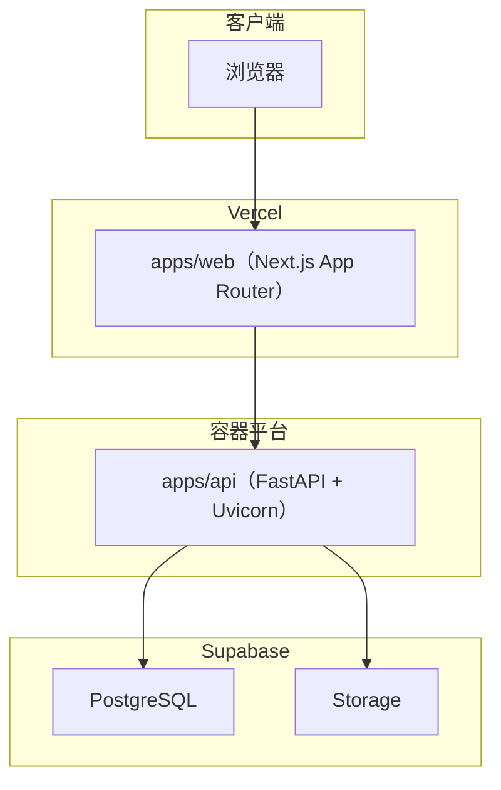

# PlotWeaver 容器架构

## 概述
Phase 1 采用三层部署模型：Web 在 Vercel，API 在独立容器平台，数据库使用 Supabase PostgreSQL。该方案在保证交付速度的同时，保持部署与运维边界清晰。

## 容器图

## 容器说明
### Web（`apps/web`）
- 技术栈：Next.js 15 + React 19
- 目标：项目管理、续写配置、生成过程、结果审阅
- 职责：
  - 路由渲染与交互
  - 调用后端 API
  - 展示 run 状态与审阅动作
- 依赖变量：
  - `NEXT_PUBLIC_API_BASE_URL`
  - `NEXT_PUBLIC_TENANT_ID`

### API（`apps/api`）
- 技术栈：FastAPI + SQLAlchemy + Alembic
- 目标：编排 run、校验契约、持久化与流式事件
- 职责：
  - 项目/章节/requirement/run 管理
  - 结构化契约校验
  - run event 与 artifact 输出
- 依赖变量：
  - `DATABASE_URL`
  - `DEFAULT_TENANT_ID`

### 数据层（Supabase PostgreSQL + Storage）
- 技术栈：PostgreSQL 16 + 对象存储
- 目标：持久化状态与产物
- 职责：
  - run 状态与 JSON artifact 入库
  - 章节版本引用管理
  - 基于租户上下文的 RLS 隔离
