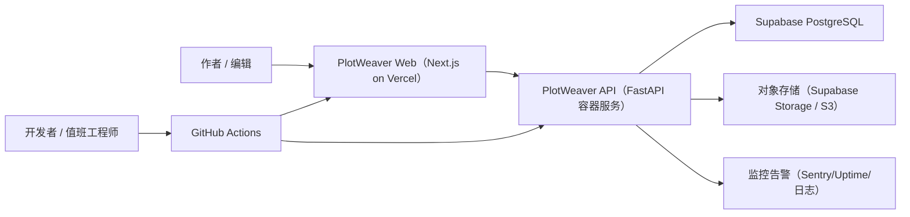

# PlotWeaver 系统上下文

## 概述
PlotWeaver 是一个全栈小说续写系统：前端使用 Next.js，后端使用 FastAPI，核心数据存储在 Supabase PostgreSQL。用户在 Web 端创建项目与 run，后端编排生成结构化产物与章节输出。

## 上下文图

## 外部系统
| 系统 | 说明 | 集成方式 |
| --- | --- | --- |
| Vercel | 托管 Next.js 前端 | 基于 Git 的 Preview / Production 部署 |
| 容器平台 | 托管 FastAPI 后端 | Docker 镜像部署 + 环境变量配置 |
| Supabase PostgreSQL | 核心关系型数据库 | SQLAlchemy + Alembic 迁移 |
| 对象存储 | 章节正文与长日志 | 数据库保存存储引用 |
| Sentry/Uptime | 错误与可用性监控 | 运行时采集与告警路由 |

## 角色与交互
| 角色 | 说明 | 主要交互 |
| --- | --- | --- |
| 作者 / 编辑 | 使用 PlotWeaver 续写与审阅 | 创建 run、查看结果、处理记忆闸门 |
| 开发者 | 开发与修复 | 提交代码、通过 CI 门禁 |
| 值班工程师 | 处理线上故障 | 按运行手册执行告警处置 |
