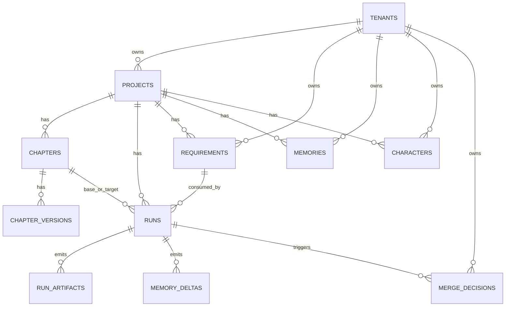

# PlotWeaver Task C：PostgreSQL Schema 与 Alembic 迁移方案

更新时间：2026-03-16

> 说明：本方案按你指定的 `software-architecture-design` 执行。`supabase-postgres-best-practices` 本地 `SKILL.md` 未找到，以下内容按 Supabase/Postgres 通用最佳实践等效落地。

## 1. Summary

目标：完成 Phase 1 可执行的数据建模与迁移路径，覆盖以下核心域：

- `project`
- `chapter`
- `run`
- `memory`
- `character`
- `requirement`

并满足：

- 多租户（tenant 级隔离）
- RLS
- 章节版本历史
- 软删除
- 审计字段
- 索引策略
- Alembic 迁移与数据回填

## 2. 架构决策（Decision Complete）

1. 多租户模式：单库单 schema + `tenant_id` 列隔离（Phase 1 推荐）
2. 鉴权集成：API 在连接后执行 `SET LOCAL app.current_tenant_id = '<tenant_uuid>'`
3. RLS 策略：所有业务表强制 `tenant_id = current_setting('app.current_tenant_id', true)::uuid`
4. 正文存储：正文与长文本放对象存储；DB 只存 metadata + storage 引用
5. 章节历史：`chapters`（当前元数据） + `chapter_versions`（正文版本）
6. 契约存储：`requirements.payload_json`、`run_artifacts.payload_json` 用 JSONB
7. 审计规范：统一 `created_at/updated_at/created_by/updated_by/deleted_at`

## 3. ERD（Phase 1）

## 4. 表设计（核心字段）

### 4.1 `tenants`

- `id uuid pk`
- `name text not null`
- `created_at timestamptz not null default now()`

### 4.2 `projects`

- `id uuid pk`
- `tenant_id uuid not null fk -> tenants.id`
- `owner_user_id uuid null`
- `title text not null`
- `description text null`
- `language text not null default 'zh-CN'`
- `status text not null default 'ACTIVE'`
- `created_at/updated_at timestamptz`
- `created_by/updated_by uuid null`
- `deleted_at timestamptz null`

约束：`unique(tenant_id, title) where deleted_at is null`

### 4.3 `chapters`

- `id uuid pk`
- `tenant_id uuid not null`
- `project_id uuid not null fk -> projects.id`
- `chapter_key text not null`（如 `chapter_005`）
- `kind text not null`（NORMAL/PROLOGUE/SIDE_STORY/EXTRA）
- `title text not null`
- `subtitle text null`
- `volume_id text null`
- `arc_id text null`
- `order_index int not null`
- `status text not null`
- `summary text not null default ''`
- `created_at/updated_at/created_by/updated_by/deleted_at`

约束：

- `unique(tenant_id, project_id, chapter_key) where deleted_at is null`
- `unique(tenant_id, project_id, order_index) where deleted_at is null`

### 4.4 `chapter_versions`

- `id uuid pk`
- `tenant_id uuid not null`
- `chapter_id uuid not null fk -> chapters.id`
- `version_no int not null`
- `source_type text not null`（GENERATED/MANUAL/REWRITE）
- `storage_bucket text not null`
- `storage_key text not null`
- `content_sha256 text not null`
- `byte_size bigint not null`
- `created_at timestamptz not null default now()`
- `created_by uuid null`
- `deleted_at timestamptz null`

约束：`unique(tenant_id, chapter_id, version_no) where deleted_at is null`

### 4.5 `requirements`

- `id uuid pk`
- `tenant_id uuid not null`
- `project_id uuid not null fk -> projects.id`
- `chapter_goal text not null default ''`
- `payload_json jsonb not null`（冻结契约）
- `payload_hash text not null`
- `source text not null default 'API'`
- `created_at/updated_at/created_by/updated_by/deleted_at`

索引：`gin(payload_json jsonb_path_ops)`

### 4.6 `runs`

- `id uuid pk`
- `tenant_id uuid not null`
- `project_id uuid not null fk -> projects.id`
- `base_chapter_id uuid null fk -> chapters.id`
- `target_chapter_id uuid null fk -> chapters.id`
- `requirement_id uuid null fk -> requirements.id`
- `state text not null`（QUEUED/RUNNING/SUCCEEDED/FAILED/NEEDS_REVIEW）
- `idempotency_key text not null`
- `error_code text null`
- `error_message text null`
- `attempt_count int not null default 0`
- `started_at/finished_at timestamptz null`
- `created_at/updated_at/created_by/updated_by/deleted_at`

约束：`unique(tenant_id, idempotency_key) where deleted_at is null`

### 4.7 `run_artifacts`

- `id uuid pk`
- `tenant_id uuid not null`
- `run_id uuid not null fk -> runs.id`
- `artifact_type text not null`（OUTLINE/REVIEW/MEMORY_GATE/CHAPTER_META）
- `version_no int not null default 1`
- `payload_json jsonb not null`
- `payload_hash text not null`
- `created_at timestamptz not null default now()`
- `deleted_at timestamptz null`

约束：`unique(tenant_id, run_id, artifact_type, version_no) where deleted_at is null`

### 4.8 `memories`

- `id uuid pk`
- `tenant_id uuid not null`
- `project_id uuid not null fk -> projects.id`
- `memory_type text not null`（WORLD_RULES/STORY_SO_FAR/OTHER）
- `storage_bucket text null`
- `storage_key text null`
- `summary_json jsonb null`
- `version_no int not null default 1`
- `created_at/updated_at/created_by/updated_by/deleted_at`

约束：`unique(tenant_id, project_id, memory_type, version_no) where deleted_at is null`

### 4.9 `characters`

- `id uuid pk`
- `tenant_id uuid not null`
- `project_id uuid not null fk -> projects.id`
- `character_id text not null`（业务稳定 ID）
- `canonical_name text not null`
- `display_name text not null`
- `aliases_json jsonb not null default '[]'::jsonb`
- `merge_status text not null default 'CONFIRMED'`
- `card_json jsonb not null`
- `created_at/updated_at/created_by/updated_by/deleted_at`

约束：`unique(tenant_id, project_id, character_id) where deleted_at is null`

### 4.10 `memory_deltas`

- `id uuid pk`
- `tenant_id uuid not null`
- `run_id uuid not null fk -> runs.id`
- `project_id uuid not null fk -> projects.id`
- `delta_type text not null`（CHARACTERS/WORLD_RULES/STORY_SO_FAR）
- `payload_json jsonb not null`
- `gate_status text not null default 'PENDING'`
- `created_at timestamptz not null default now()`
- `deleted_at timestamptz null`

### 4.11 `merge_decisions`

- `id uuid pk`
- `tenant_id uuid not null`
- `project_id uuid not null fk -> projects.id`
- `run_id uuid null fk -> runs.id`
- `decision_type text not null`（MERGE/SPLIT/ALIAS_LINK/REJECT）
- `payload_json jsonb not null`
- `reason text null`
- `created_at timestamptz not null default now()`
- `created_by uuid null`
- `deleted_at timestamptz null`

## 5. RLS 策略模板（所有业务表一致）

前置：

- 业务连接必须设置：`SET LOCAL app.current_tenant_id = '<tenant_uuid>'`

策略模板：

- `USING (tenant_id = current_setting('app.current_tenant_id', true)::uuid)`
- `WITH CHECK (tenant_id = current_setting('app.current_tenant_id', true)::uuid)`

适用表：

- `projects/chapters/chapter_versions/requirements/runs/run_artifacts/memories/characters/memory_deltas/merge_decisions`

## 6. 索引策略（Phase 1 必做）

1. 所有外键列建立 BTREE 索引
2. 高频过滤组合索引：
   - `runs(tenant_id, project_id, state, created_at desc)`
   - `chapters(tenant_id, project_id, order_index)`
   - `run_artifacts(tenant_id, run_id, artifact_type, version_no desc)`
   - `characters(tenant_id, project_id, merge_status)`
3. JSONB 索引：
   - `requirements.payload_json` GIN
   - `run_artifacts.payload_json` GIN
4. 软删除场景尽量使用部分索引 `where deleted_at is null`

## 7. Alembic 迁移顺序（建议 revision 计划）

1. `001_base_extensions`
   - 启用 `pgcrypto`（`gen_random_uuid()`）
2. `002_tenants_projects`
3. `003_chapters_and_versions`
4. `004_requirements_runs`
5. `005_run_artifacts`
6. `006_memories_characters`
7. `007_memory_deltas_merge_decisions`
8. `008_indexes_and_constraints`
9. `009_rls_policies`
10. `010_backfill_from_day6`

迁移原则：

- 每个 revision 可单独回滚
- 先建表再加复杂约束
- RLS 在表结构稳定后统一上线

## 8. 数据回填方案（Day6 文件 -> DB）

回填输入：

- `novel-agent-day6/inputs/demo/*`
- `novel-agent-day6/outputs/demo/*`

回填顺序：

1. 建 `tenant` 与 `project`
2. 扫描 `inputs/.../chapters/index.txt` 生成 `chapters`
3. 将现有 `chapter.txt/title.txt/chapter_meta.json` 统一写入 `chapters + chapter_versions`
4. 回填 `requirements`（从 continuation req 文件与 run 记录构建）
5. 回填 `runs`（按 chapter 生成过程建立状态）
6. 回填 `run_artifacts`（outline/review/memory_gate/chapter_meta）
7. 回填 `characters` 与 `memory_deltas`
8. 对同名角色冲突写入 `merge_decisions`（`PENDING_REVIEW`）

校验门槛：

- 每个 run 至少存在 `OUTLINE` 与 `REVIEW` artifact
- 每章至少一个 `chapter_version`
- `characters.character_id` 不可为空
- 所有业务表 `tenant_id` 非空

## 9. 性能与风险

### 9.1 主要风险

1. JSONB 过度膨胀导致查询慢
2. RLS 条件漏加造成租户越权
3. 软删除 + 唯一约束组合处理不当
4. `chapter_versions` 增长后列表查询退化
5. 回填脚本幂等性不足导致重复数据

### 9.2 缓解措施

1. 保持“可筛选字段列化 + 复杂结构 JSONB”平衡
2. 所有业务表启用 RLS 并在 CI 跑越权用例
3. 使用 `where deleted_at is null` 的部分唯一索引
4. 章节详情页只取最新版本，历史分页加载
5. 回填使用 `idempotency_key + upsert`，每步输出校验报告

## 10. 本阶段不做（明确边界）

1. 不做分库分片
2. 不做事件总线/CDC 复杂链路
3. 不做向量检索与全文检索优化
4. 不做跨区域多活

## 11. 完成标准（Task C Done）

1. Schema 评审通过且字段冻结
2. Alembic revision 顺序确定并可执行
3. RLS 策略在本地 docker postgres 验证通过
4. Day6 样例数据完成一次回填演练并通过校验
5. 风险清单与回滚策略文档化
